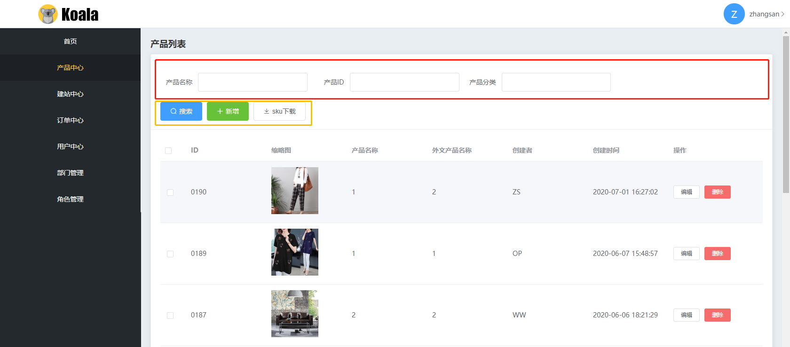
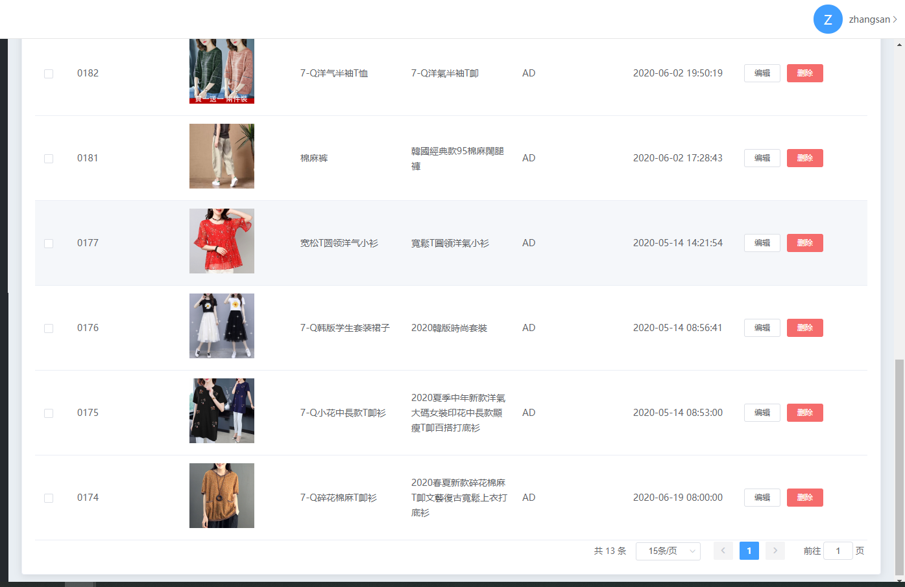
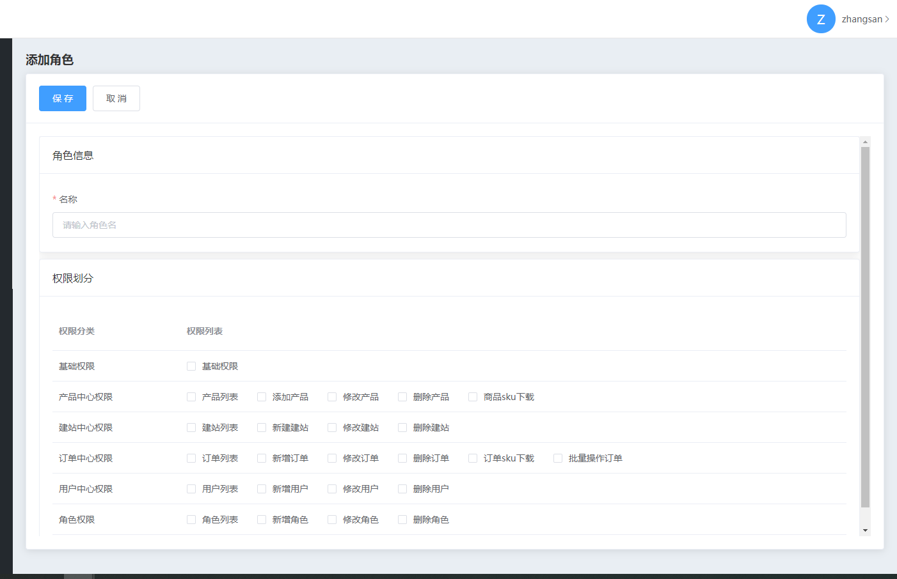
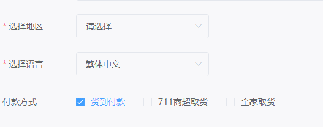

## 配置开发方式
后端管理大部分页面都比较固定，所以在没有特殊需求的情况下，通过配置即可完成页面的开发，目前框架中默认提供的页面级组件有列表页组件（`CommonListPage`）和表单页组件（`CommonFormPage`）

在路由配置中，需要将配置在meta对象中引入，列表页的配置参考如下
### 列表页配置文件
#### 路由配置
```js
{
    path: '/',
    name: 'product',
    meta: {
        title: '产品列表',
        topConfig: require('../views/product/topOperator').default, // 加载页面的顶部操作配置
        viewConfig: require('../views/product/list').default,       // 加载页面配置
    },
    component: () => import('@/views/product/CommonListPage.vue')   // 使用以上配置填入CommonListPage.vue生成页面
}
```
#### 配置文件

##### topOperator.js 顶部配置
这个配置文件是配置列表页的顶部操作区，对应如图

- 红色区域为`searchFilters`的配置结果
- 黄色区域为`topOperator`配置的结果

**searchFilters**配置说明
这里的配置
```js
const searchFilters = {
    // 行容器
    rows: [
        {
            // 列容器
            cols: [
                // 具体配置
                {
                    label: '产品名称',            // 显示的名称
                    component: 'SearchInput',     // 使用的搜索过滤器组件
                    attrs: {                      // 传递给组件的属性
                        queryKey: 'chinese_name', // 搜索的key，如果是页面级的配置，会显示在url上
                        placehoder: '输入关键字'    
                    }
                }
            ]
        }
    ]
}
```

**topOperators**配置说明
这个配置和下方的`topOperatorEvents`配置配合使用，`topOperators`配置只包含视图，不处理事件，`topOperatorEvents`只处理事件
```js
const topOperators = [
    {
        key: 'search',              // 用于绑定事件时使用的key
        name: '搜索',               // 组件显示的名称
        power: '',                  // （选填）视图权限名称
        component: '',              // （选填）不填默认会用el-button来渲染，如果有自定义的组件需求，可以填写组件名
        attrs: {                    // 传递给组件的属性
            type: 'primary',
            icon: 'el-icon-search'
        },
        events: {}                  // 事件处理（一般不写）
    }
]
```

**topOperatorEvents**配置说明
这个配置配合`topOperators`配置，实现每个组件的事件，您可以像search这样直接将点击事件的处理下载配置中，也可以像下方add和export那样，将具体实现绑定在函数上
```js
const topOperatorEvents = {
  search: {
    click: () => {
      store.commit('setSearchFilterSig')
    }
  },
  add: {
    click: Add
  },
  export: {
    click: Export
  }
}

const Add = () => {
  store.commit('setDialogValue', null)
  router.push({name: 'addProduct'})
}

const Export = async (e, selection) => {
  let ids = selection.map((select) => {
    return select.id
  })
  try {
    let res = await api.ExportProducts(ids)
    window.open(res.url)
  } catch(e) {
    console.log(e)
  }
  
}
```

`topOperator.js`的完整示例
```js
import store from '../../store'     // 获取vuex实例，用于获取仓储中的状态以及mutation
import router from '../../router'   // 获取路由实例，用于跳转页面以及获取vue实例
import api from '../../plugins/api' // 获取接口实例，用于调用接口

// 搜索过滤器
const searchFilters = {
  rows: [
    {
      cols: [
        {
          label: '产品名称',            // 显示的名称
          component: 'SearchInput',     // 使用的搜索过滤器组件
          attrs: {                      // 传递给
            queryKey: 'chinese_name',
            placehoder: '输入关键字'
          }
        },
        {
          label: '产品ID',
          component: 'SearchInput',
          attrs: {
            queryKey: 'id',
            placehoder: '输入关键字'
          }
        },
        {
          label: '产品分类',
          component: 'SearchInput',
          attrs: {
            queryKey: 'type',
            placehoder: '输入关键字'
          }
        }
      ]
    }
  ]
}

const topOperators = [
  {
    key: 'search',
    name: '搜索',
    attrs: {
      type: 'primary',
      icon: 'el-icon-search'
    },
    events: {}
  },
  {
    key: 'add',
    name: '新增',
    power: 'addProduct',
    attrs: {
      icon: 'el-icon-plus',
      type: 'success'
    },
    events: {}
  },
  {
    key: 'export',
    name: 'sku下载',
    power: 'downloadSku',
    attrs: {
      icon: 'el-icon-download',
      type: 'default'
    },
    events: {}
  }
]

const topOperatorEvents = {
  search: {
    click: () => {
      store.commit('setSearchFilterSig')
    }
  },
  add: {
    click: Add
  },
  export: {
    click: Export
  }
}

const Add = () => {
  store.commit('setDialogValue', null)
  router.push({name: 'addProduct'})
}

const Export = async (e, selection) => {
  let ids = selection.map((select) => {
    return select.id
  })
  try {
    let res = await api.ExportProducts(ids)
    window.open(res.url)
  } catch(e) {
    console.log(e)
  }
  
}

export default {
  searchFilters,
  topOperators,
  topOperatorEvents
}
```
##### list.js 列表配置
这个配置文件主要控制列表显示以及分页的部分


**headermap**配置说明
```js
const headermap = [
  {
    name: '缩略图',             // 表头名称
    key: 'image',               // 表头和数据对应的key
    component: 'table-image',   // 使用的组件（可选，默认是文字显示）
    comAttrs: {                 // 传给组件的属性
      fit: 'cover',
      height: '100px',
      width: '100px'
    }
  },
  // 操作组件传参示例
  {
    name: '操作',
    key: 'op',
    attrs: {
      width: '200'
    },
    component: 'table-operator',
    comAttrs: {
      // 操作项配置
      optionsFilter: [
        {
          name: '编辑',
          attrs: {
            size: 'mini'
          },
          power: 'editProduct',
          // 操作项事件处理
          events: {
            // 默认接收el-table-column的scope插槽数据，可以结构row来使用
            click: ({row}) => {
              Edit(row)
            }
          }
        },
        {
          name: '删除',
          attrs: {
            size: 'mini',
            type: 'danger'
          },
          power: 'deleteProduct',
          events: {
            click: ({row}) => {
              Delete(row)
            }
          }
        }
      ]
    },
    comEvents: {}
  }
  ...
]
```

`list.js`完整示例
```js
import api from '../../plugins/api'
import store from '../../store'
import router from '../../router'
import Time from '../../libs/moment'

const headermap = [
  {
    name: 'ID',
    key: 'formatId'
  },
  {
    name: '缩略图',
    key: 'image',
    component: 'table-image',
    comAttrs: {
      fit: 'cover',
      height: '100px',
      width: '100px'
    }
  },
  {
    name: '产品名称',
    key: 'chinese_name'
  },
  {
    name: '外文产品名称',
    key: 'foreign_name'
  },
  {
    name: '创建者',
    key: 'sg_user.nickname'
  },
  {
    name: '创建时间',
    key: 'created_at'
  },
  {
    name: '操作',
    key: 'op',
    attrs: {
      width: '200'
    },
    component: 'table-operator',
    comAttrs: {
      optionsFilter: [
        {
          name: '编辑',
          attrs: {
            size: 'mini'
          },
          power: 'editProduct',
          events: {
            click: ({row}) => {
              Edit(row)
            }
          }
        },
        {
          name: '删除',
          attrs: {
            size: 'mini',
            type: 'danger'
          },
          power: 'deleteProduct',
          events: {
            click: ({row}) => {
              Delete(row)
            }
          }
        }
      ]
    },
    comEvents: {}
  }
]

const Edit = (item) => {
  router.push({name: 'editProduct', query: {
    id: item.id
  }})
}

const  Delete = async (item) => {
  if (confirm('是否确定删除')) {
    await api.DeleteProduct(item.id)
    store.commit('getListData')
  }
}


const getListData = async (query) => {
  console.log('获取建站前', store.state.userInfo)
  if (store.state.userInfo.id_poi_role != 1) {

    if (!query.where) {
      if (store.state.userDepartment.id_poi_users == store.state.userInfo.id) {
        let users = await api.GetDepartmentUsers(store.state.userDepartment.id)
        query.where = {
          id_poi_users: {
            $in: users.items.map((user) => {
              return user.id
            })
          }
        }
      } else {
        query.where = {
          id_poi_users: store.state.userInfo.id
        }
      }
      
    } else {
      if (store.state.userDepartment.id_poi_users == store.state.userInfo.id) {
        let users = await api.GetDepartmentUsers(store.state.userDepartment.id)
        query.where = {
          ...query.where,
          id_poi_users: {
            $in: users.items.map((user) => {
              return user.id
            })
          }
        }
      } else {
        query.where = {
          ...query.where,
          id_poi_users: store.state.userInfo.id
        }
      }
      
    }
  }
  let res = await api.GetProducts(query)
  res.items.map((item) => {
    item.formatId = '0'.repeat(4 - item.id.toString().length) + item.id
    item.created_at = Time(item.created_at)
    item.updated_at = Time(item.updated_at)
  })
  return res
}

export default {
  headermap,
  getListData
}
```
### 表单页配置文件
#### 路由配置
```js
{
    path: 'add',
    name: 'addRole',
    meta: {
        title: '添加角色',
        viewType: 'add',                                    // 页面类型，add为添加、edit为编辑、preview为预览
        formConfig: require('../views/role/form').default,  // 表单配置文件
    },
    component: () => import('@/components/page/CommonFormPage.vue') // 用CommonFormPage读取以上配置生成页面
},
```

#### 配置文件
##### form.js 配置文件
这个文件可以配置出大部分常用的表单，可以通过配置子表单来控制视图的排列方式，配置结果如下图


`form.js`完整示例
```js
import api from '../../plugins/api'
import store from '../../store'

const forms = [
  {
    name: '角色信息',
    formInfo: [
      {
        name: '名称',
        component: 'el-input',
        key: 'name',
        default: '',
        attrs: {
          placeholder: '请输入角色名',
        },
        rules: [
          { required: true, message: '请输入角色名', trigger: 'blur' }
        ]
      }
    ]
  },
  {
    name: '权限划分',
    attrs: {
      labelWidth: '0px',
      style: 'width:100%',
      noLabel: true
    },
    formInfo: [
      {
        name: '',
        component: 'PowerPicker',
        key: 'power_groups',
        innerText: '权限列表'
      }
    ]
  }
]

// 添加时的表单配置
const addConfig = {}

// 编辑时的表单配置
const editConfig = {}

// 提交函数
const Submit = async ({hasError, form}) => {
  // 判断所有表单是否有错误
  // form为合并后的表单数据
  if (hasError) return
  // 根据配置的viewType来判断进入哪个提交分支
  switch(store.getters.viewType()) {
    case 'add':
      await api.CreateRole(form)
      // 在这里可以用router返回列表
      break
    case 'edit':
      await api.UpdateRole(form)
      // 在这里可以用router返回列表
      break
    default:
      break
  }
  // 提交完成后，刷新列表数据
  store.commit('getListData')
}

// 获取表单的数据，一般在详情页和编辑页可以实现这个函数
const getData = async (id) => {
  let res = await api.GetRole(id)
  // console.log(res)
  return res.data
}

export default {
  forms,
  addConfig,
  editConfig,
  Submit,
  getData
}
```

## 一般开发方式
如果您对上述的配置开发方式觉得无法接受，您还是可以按照原来的开发方式，在router/index.js中配置路由时，指向具体的页面组件，例如
```js
{
    path: '/',
    name: 'index',
    meta: {
        title: '首页'
    },
    component: () => import('@/views/page/index.vue')
}
```
## 混合开发方式
如果您能接受配置方式开发，但是发现有一些配置无法方便完成的场景，可以借助配置完成大部分重复工作，然后使用vue组件完成其他部分，例如页面上有很多动态交互内容，组件之间出现了互相依赖数据发生变化的情况，例如

地区的选择会影响语言的选择，解决这样的情况有两种方式



纯配置的方式实现的话，可以将地区组件和语言组件封装在一起成为一个新的组件，在表单配置中使用这个新的组件即可。

如果不想封装在一起，您可能会借助CommonForm组件的onFormValueChange事件来监听表单内发生的变化，再赋值

路由配置
```js
{
    path: 'add',
    name: 'addSite',
    meta: {
        title: '添加落地页',
        viewType: 'add', // 页面类型，add添加，edit编辑，preview查看，使用通用表单页组件可以直接区分新增、编辑和查看页
    },
    component: () => import('@/views/site/Form.vue')    // 指向具体的vue组件，这个组件可以复制一份CommonFormPage来修改
},
```

代码部分
```vue
<template lang="pug">
    //- 其他部分省略
    common-form(
        ref="form"
        v-bind="form.attrs"
        :options="form.formInfo"
        :values="value"
        @onFormValueChange="onFormValueChange"
        )
</template>

<script>
export default {
    // 其他部分略
    methods: {
        onFormValueChange({item, value}) {
            // 地区字段发生改变
            if (item.key == 'id_poi_area') {
                // 处理语言的变化
                this.$nextTick(() => {
                    if (value == 1) {
                        this.$refs.form[0].form['id_poi_language'] = 1
                    }
                })
            }
        }
    }
}
</script>

```