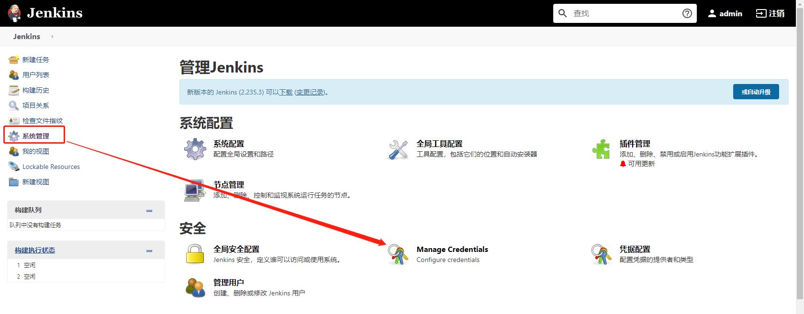

# 概述
为了方便构建项目，我们所有的项目都采用jenkins配合docker进行部署，因此阅读本文档前，您应该对jenkins和docker有一定的了解。

* 安装jenkins可以参考[CentOS7安装Jenkins](https://blog.csdn.net/nklinsirui/article/details/89382092)或者也使用docker中的jenkins镜像来安装。

* docker的安装可以直接在更新docker的yum源进行安装。

**注意**
jenkins运行时要使用root账户，避免各类权限问题

## 一些准备
### ssh凭证
构建项目的步骤是，通过git将项目拉到ecs本地，通过项目内的dockerfile进行构建，因此需要您将凭证提前加好

## Jenkinsfile
所有的项目都通过github项目[jenkins-template](https://github.com/flashtd1/jenkins-template)进行统一的流水线构建，您可以提前进入项目进行查看，如果需要修改，可以自行fork后在构建时使用自己的模板。

项目中主要包含3个jenkinsfile，分别对应**nginx（Jenkinsfile-nginx）**,**服务类项目(Jenkinsfile)**以及**静态网站(Jenkinsfile-static)**

## 新建任务
以上准备内容完成之后，我们就可以开始新建构建任务了
### 新建任务
填写任务名称

#### 您可以复制准备好的空模板
填写需要复制的模板名称

#### 也可以自己新建一个任务

选择流水线（pipeline）

勾选参数化构建

新建9个参数，名称和类型如下

| 序号 | 参数名 | 类型 | 说明 |
| --- | --- | --- | --- |
| 1. | WriteFile    | 文本类型    | 配置文件内容        |
| 2. | GitUrl       | 字符类型    | git地址             |
| 3. | branch       | 字符类型    | 分支名              |
| 4. | credId       | 字符类型    | ssh凭证id           |
| 5. | origin_repo  | 字符类型    | 源容器仓库名称(如果传阿里云可以写阿里云容器仓库url)      |
| 6. | repo         | 字符类型    | 项目名称            |
| 7. | image_tag    | 字符类型    | 镜像名称            |
| 8. | out_ip       | 字符类型    | 对外暴露的端口号    |
| 9. | in_ip        | 字符类型    | 容器内部的端口号    |

下方流水线按如图所示填写

* **脚本路径**按照您部署的类型填写不同的内容，nginx填写Jenkinsfile-nginx, 服务类填写Jenkinsfile, 静态网站填写 Jenkinsfile-oss